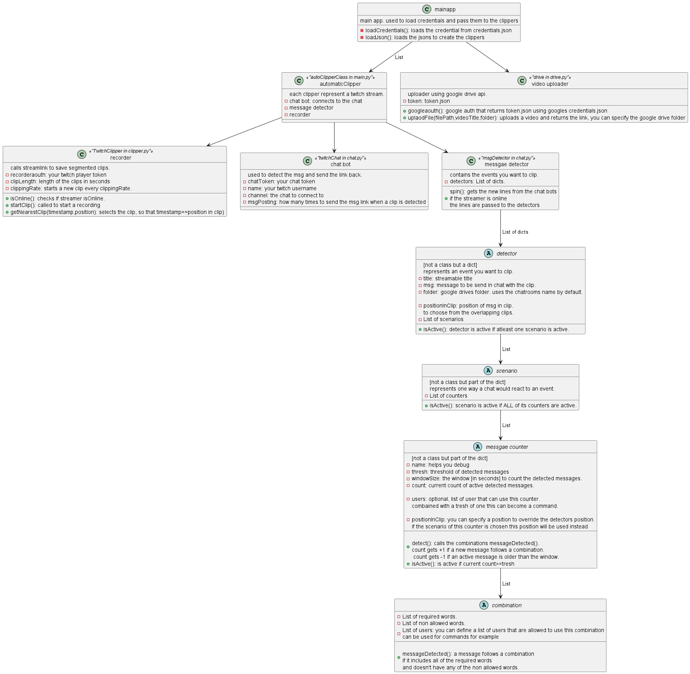

# Atomatic Twitch Clipper, by ZiedYT
DM me for any issues :)

## Features
- clips a twitch livestream depending on the messages in chat. (eg: spamming the same thing)
- uploads the clip
- sends the clip to chat.

## installation
- Download the repo
- get python (I am using 3.10)
- go to the folder, run `pip install -r requirements.txt`
- install streamlink CLI. https://streamlink.github.io/install.html
- Get your credentials and type them in `secrets.json`:
    - clipperChannel: your twitch name   
    - chatToken: your chat aouth. you can use https://twitchapps.com/tmi/ copy the token
    -  recorderaouth: your twitch player token used to get the stream. 
        - Log out from twitch
        - Log in on Twitch.tv in your web browser
        - Press F12, go to console
        - type `document.cookie.split("; ").find(item=>item.startsWith("auth-token="))?.split("=")[1]`
        - you will get the token back, copy it in the json
    - google's credentials.json and token.json: 
        - register a google cloud. dont forget to add your google account as a user
        - get the client_secret and rename it to credentials.json
        - move the file into the directory and run `python googleaouth.py`
        - you will be asked to login to google
        - you will now get the token.json

## Running
- open the directory in cmd
- run `python main.py`, or `python app.py` that provides a simple feedback html page on localhost:8080
## Making your own clippers
- you need to create a new json file {channelname}.json or define the params in your env
- there is a class diagram below that describes how it works
- you can also follow the three json files I have provided as an example
- add a `"{channelname}.json":true` in your secrets.json

